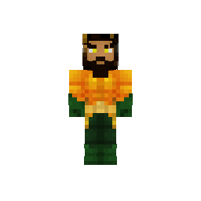
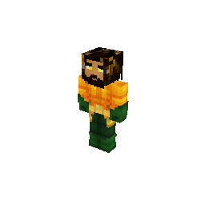
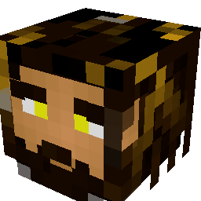
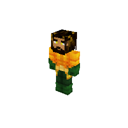
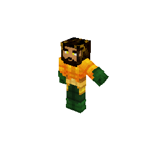

# bedrock-skin

**Render Minecraft Bedrock skins to PNG and GIF, in pure Go.** 3D bodies, heads and avatars, capes, slim and wide arms, custom geometry, persona skins, animations from Blockbench files, and a detector for invisible skins.

<p align="center">
  
  
  
  
  
</p>

Texture in, `image.Image` out. No GPU, no headless browser, no external process — a small software rasterizer of its own, written for skins - the matrix maths and clipping come from [fauxgl](https://github.com/fogleman/fauxgl). It reads skins the way a Bedrock (MCPE) client sends them, so it drops straight into a proxy, a server plugin, a Discord bot or a website.

```bash
go get github.com/THEBOSS9345/bedrock-skin-go
```

```go
import bedrockskin "github.com/THEBOSS9345/bedrock-skin-go"
```

The package is `bedrockskin`. A Rust version, `bedrock-skin`, is on the way, built to render the same images.

## Quick start

```go
package main

import (
	"image/png"
	"os"

	bedrockskin "github.com/THEBOSS9345/bedrock-skin-go"
)

func main() {
	f, err := os.Open("skin.png")
	if err != nil {
		panic(err)
	}
	defer f.Close()

	tex, err := png.Decode(f)
	if err != nil {
		panic(err)
	}

	img, err := bedrockskin.Render(bedrockskin.Options{Texture: tex})
	if err != nil {
		panic(err)
	}

	out, err := os.Create("body.png")
	if err != nil {
		panic(err)
	}
	defer out.Close()
	png.Encode(out, img)
}
```

That renders the full body of a standard humanoid, straight on, at 512×512.

### Or work in bytes

If you already hold encoded bytes and want encoded bytes back, skip the decode and encode:

```go
out, err := bedrockskin.RenderBytes(bedrockskin.BytesOptions{
	Texture:  textureBytes,  // encoded PNG or JPEG
	Geometry: geometryBytes, // raw geometry.json; nil or "null" is fine
	View:     bedrockskin.ViewAvatar,
	Size:     128,
})
```

Both paths run the same renderer and produce identical output — use whichever fits. Options render themselves too, if you prefer:

```go
img, err := bedrockskin.Options{Texture: tex}.Render()     // image.Image
raw, err := bedrockskin.Options{Texture: tex}.RenderPNG()  // []byte
```

Skins coming off the wire arrive as raw RGBA rather than an encoded image; `TextureFromRGBA` wraps those without copying.

## Geometry is optional, and that matters

Passing no geometry is not a shortcut — for most real skins it is the correct input.

A Bedrock client sends **no mesh at all** for a skin that uses one of the built-in models. Its login packet carries the literal JSON `null` in `SkinGeometryData`, and names the model only in the skin's resource patch:

```json
{ "geometry": { "default": "geometry.humanoid.custom" } }
```

Both ends already have the model, so it never travels the wire. Geometry only shows up for skins with a genuinely custom mesh. If you are proxying real players, you will very often have nothing to pass — so `Options.Geometry: nil` falls back to the vanilla humanoid bundle, which is what the client itself would draw.

When a skin *does* carry geometry, parse and pass it:

```go
geos, err := bedrockskin.ParseGeometry(raw)
if err != nil {
	return err
}

img, err := bedrockskin.Render(bedrockskin.Options{
	Texture:    tex,
	Geometry:   geos,
	Identifier: "geometry.humanoid.customSlim",
	View:       bedrockskin.ViewAvatar,
	Angle:      bedrockskin.AngleIso,
	Size:       256,
})
```

`ParseGeometry` accepts both of Bedrock's on-the-wire formats — the modern `minecraft:geometry` array and the pre-1.12 flat top-level-key form — and detects which is which.

To tell "this skin has no custom mesh" apart from "this upload is broken" before parsing, use `IsEmpty`. It reports true for empty input and for that literal `null` (with or without a trailing newline, which real captures show both of).

### Picking wide vs slim

The bundled default carries three entries: `geometry.humanoid.custom` (wide arms), `geometry.humanoid.customSlim` (slim arms), and `geometry.cape`. Set `Identifier` to choose; omit it and the wide body wins.

Take that identifier from the skin's **resource patch**, not from the login packet's `ArmSize` field. Real captures show the two disagreeing — a skin reporting `ArmSize: "wide"` whose patch names `customSlim`. The patch is authoritative.

## Options

| Field | Meaning |
| --- | --- |
| `Texture` | Decoded skin image. The only required field. |
| `Geometry` | From `ParseGeometry`. Nil uses `DefaultGeometry()`. |
| `Identifier` | Which entry to render. Empty picks the one with the most cubes. |
| `Cape` | Cape texture. Drawn from the geometry's own `cape` entry, falling back to the bundled `geometry.cape`, so it works for custom-mesh skins too. Skipped for head and avatar views. |
| `View` | `ViewBody`, `ViewChest`, `ViewHead`, `ViewAvatar`. Zero means `ViewBody`. |
| `Angle` | `AngleFront` or `AngleIso`. Zero means the view's own default. |
| `Parts` | Explicit bone names, e.g. `[]string{"head", "leftArm"}`. Overrides `View`. |
| `Camera` | Explicit yaw/pitch/FOV/margin. Overrides `Angle`. |
| `Size` | Output edge length. Zero means 512. Always square. |
| `Armor` | Armor and elytra worn over the skin, one texture per piece. `ArmorSet(layer1, layer2)` for a full set. |
| `RightHand`, `LeftHand` | An item held in each hand, placed as the game places it, with an optional `Adjust` to move, turn or resize it. |
| `Scale` | The figure's size in the image (`Model`) and per-bone scales (`Parts`). |

Bone scoping is ancestry-based, so naming `head` also pulls in whatever is parented under it — a hat, hair, ears, a party hat. Custom-geometry skins work with no special-casing and no hardcoded bone list.

## Skins straight from a packet

A proxy or bot holds a skin the way the client sent it: raw RGBA, `null` geometry for a built-in model, a resource patch naming the model, and - for a persona skin - animation images carrying its face. `WireSkin` takes those fields as they are and gives back ready Options, the right model picked and the face attached:

```go
opts, err := bedrockskin.WireSkin{
	SkinData: s.SkinData, SkinWidth: int(s.SkinImageWidth), SkinHeight: int(s.SkinImageHeight),
	CapeData: s.CapeData, CapeWidth: int(s.CapeImageWidth), CapeHeight: int(s.CapeImageHeight),
	Geometry: s.SkinGeometry, ResourcePatch: s.SkinResourcePatch,
	Animations: animations, // []WireAnimation{{Type, Data, Width, Height}} from s.Animations
}.Options()
opts.View = bedrockskin.ViewAvatar
err = opts.WritePNG(w) // straight to an http.ResponseWriter
```

`WireSkin.Skin()` gives the invisibility detector the same fields. `Options.WritePNG` and `WriteGIF` write to any `io.Writer` without holding the encoded bytes first.

## Parsing request and packet fields

`ParseView`, `ParseAngle` and `ParseParts` turn request parameters into options, and the first two **reject** names they don't recognise rather than silently falling back — so a request for `avatr` is a 400, not a full-body render.

`ParseResourcePatch` reads the login packet's `SkinResourcePatch` and returns the geometry identifier to pass as `Identifier`. Use it rather than `ArmSize`: real captures show `ArmSize` reporting `wide` for a skin whose patch names `customSlim`.

Every error `Render` returns is bad caller input and has a sentinel — `ErrNoTexture`, `ErrNoGeometry`, `ErrNoMatchingParts`, `ErrEmptyView` — so `errors.Is` classifies them without matching message text.

## Armor, elytra and held items

Dress the skin in armor or an elytra and put an item in either hand. The textures come from a resource pack, as the game lays them out:

```go
img, err := bedrockskin.Render(bedrockskin.Options{
	Texture:   tex,
	Armor:     bedrockskin.ArmorSet(diamond1, diamond2), // diamond_1.png, diamond_2.png
	RightHand: bedrockskin.Held{Item: diamondSword},     // diamond_sword.png
	LeftHand:  bedrockskin.Held{Item: bread, Flat: true},
})
```

Pieces mix freely (`Armor{Helmet: gold1, Boots: iron1}`), and equipment moves with every animation. Items sit where the game puts them; for one that does not suit, `Held.Adjust` moves, turns or resizes it. `Options.Scale` resizes the whole figure or any part of it.

Any of it renders on its own too: `Options.HideSkin` draws the equipment without the skin - the elytra alone, a helmet with `View: ViewHead` - and `RenderItem` draws an item by itself. See [docs/equipment.md](docs/equipment.md).

## Animation

Skins move too: Minecraft's own player motions built in (`MotionWalk`, `MotionIdle`, `MotionWave`, `MotionSneak`), or any animation from a Bedrock animation file - what Blockbench exports - with keyframes, smooth interpolation and Molang expressions. `RenderGIF` makes a looping GIF; `RenderFrames` returns the frames; `Options.Pose` renders one pose as a still.

```go
anims, _ := bedrockskin.ParseAnimations(blockbenchExport)
gifBytes, err := bedrockskin.RenderGIF(bedrockskin.AnimationOptions{
	Options:   bedrockskin.Options{Texture: tex, Size: 256},
	Animation: anims["animation.player.wave"], // or bedrockskin.MotionWalk
})
```

33 example animations come bundled — dances, emotes, a backflip, fighting moves — as `ExampleAnimations()` and as files in [examples/animations](examples/animations). Not every Minecraft animation plays on every model: an animation moves bones by name, so one made for a mob with wings or a tail does nothing on a player, and ones driven by the game's state (where a mob looks, what it holds) hold still. `MissingBones` tells you. See [docs/animation.md](docs/animation.md).

## Reading geometry files

`ParseGeometryTree` reads a whole geometry file and picks any value out of it by path, the way bones are picked by name:

```go
tree, _ := bedrockskin.ParseGeometryTree(raw)
pivot, _ := tree.Get("geometry.humanoid.custom/bones/rightArm/pivot") // [-5, 22, 0]
sizes := tree.Select("*/bones/*/cubes/*/size")                       // every cube's size
```

See [docs/geometry-format.md](docs/geometry-format.md#picking-values-out-of-a-file).

## Persona skins

Persona (character creator) skins are built from poly meshes instead of cubes, and render in 3D like any other model. Their parts are spread over several geometry entries, and the head is textured by the skin's face animation rather than the skin image - pass the animation images to draw it:

```go
img, err := bedrockskin.Render(bedrockskin.Options{
	Texture:  tex,
	Geometry: geos,
	Animated: []bedrockskin.AnimatedTexture{{Type: bedrockskin.AnimatedFace, Texture: face}},
})
```

Without them the body renders and the head view returns `ErrEmptyView`. See [docs/geometry-format.md](docs/geometry-format.md#persona-skins).

## Detecting invisible or partly-invisible skins

The same inputs also feed an **invisibility detector** - for blocking the "invisible player" hack. Bundle a texture with its geometry and ask the high-level `Skin` type:

```go
skin := bedrockskin.NewSkin(tex, geoBytes) // geoBytes may be nil

switch rep := skin.Report(); rep.Verdict {
case bedrockskin.VerdictInvisible:
	// nothing renders, or only a stray limb
case bedrockskin.VerdictSuspicious:
	// some standard parts missing, but not all - a soft signal
case bedrockskin.VerdictOK:
	// renders normally
}
```

`Report()` gives a structured answer: a single `Verdict` (`ok`, `suspicious`, `invisible`, or `unknown` for a report never filled in), how many of the six standard parts render, and a per-part breakdown with opaque ratios - JSON-tagged and ready to marshal for an API. Anything derivable is a method rather than a field, so the JSON cannot contradict itself. `skin.OK()`, `skin.IsInvisible()`, `skin.IsSuspicious()` and `skin.InvisibleParts()` are the one-liner forms.

Key behaviour:

- **Strict when geometry is provided** - the detector cross-references geometry cube UVs against the real texture alpha, so a transparent region can't pass just because geometry maps there, and bones too small to see are caught.
- **Lenient without geometry** - the standard vanilla humanoid UV layout is assumed.
- **Persona skins are measured too** - their poly meshes are checked where their UVs point, and parts drawn only from an animation image the detector never sees (the head) are trusted. Unreadable geometry is checked against the texture instead, so it can't be used to switch the detector off.
- **A cape never masks an invisible body.**
- **Thresholds are yours to set** - `NewSkinWithOptions` takes `SkinOptions`; the zero value is what `NewSkin` uses.

See [docs/README.md](docs/README.md) and [docs/api-reference.md](docs/api-reference.md#invisibility-detection) for the full API and a worked recipe in [docs/recipes.md](docs/recipes.md#detect-an-invisible-or-partly-invisible-skin).

## Untrusted input

The library enforces no limits of its own, because what counts as too large is policy, not physics. If you accept arbitrary uploads:

- Bound the geometry document with `Complexity`, which returns total bones and cubes across every entry, before rendering.
- Bound image dimensions with `ImageDimensions` before a full decode; it reads only the header. A few-KB PNG can declare enormous dimensions and force a huge allocation.
- Bound concurrency. Each render is single-threaded CPU work, so throughput comes from running several at once — but cap that, to bound memory in flight and fail fast under a spike.

## Try it

```bash
go run github.com/THEBOSS9345/bedrock-skin-go/cmd/bedrock-skin@latest skin.png avatar.png avatar iso 256
go run github.com/THEBOSS9345/bedrock-skin-go/cmd/bedrock-skin@latest skin.png dance.gif dance
```

The arguments are a view (`body`, `chest`, `head`, `avatar`), a motion (`walk`, `idle`, `wave`, `sneak`) or an example animation (`dance`, `backflip`, ...), then an angle and a size; `-geometry` and `-cape` add a model and a cape.

## Documentation

The [`docs/`](docs/) directory goes well beyond this README:

| | |
| --- | --- |
| [skin-data.md](docs/skin-data.md) | What a Bedrock client actually sends over the wire |
| [geometry-format.md](docs/geometry-format.md) | The geometry.json format, both versions |
| [rendering-pipeline.md](docs/rendering-pipeline.md) | How a bone tree becomes pixels, stage by stage |
| [views-and-cameras.md](docs/views-and-cameras.md) | Bone scoping, framing and camera math |
| [api-reference.md](docs/api-reference.md) | Every exported symbol |
| [recipes.md](docs/recipes.md) | Worked examples |
| [design-decisions.md](docs/design-decisions.md) | Why the library works the way it does |

## Contributing

Pull requests welcome.

**Using AI to write your contribution is completely fine** — no objection here at all. One ask: **point it at [`docs/`](docs/) before it writes anything.** That directory exists precisely so a newcomer, human or model, can understand what this project is and how it fits together without guessing.

[docs/rendering-pipeline.md](docs/rendering-pipeline.md) and [docs/design-decisions.md](docs/design-decisions.md) are the two that matter most. A lot of this code looks arbitrary until you know what it prevents — the texture coordinate flip, the missing `Viewport` call, alpha testing instead of blending, selecting geometry by cube count. Each of those is a real bug that was already fixed once, and each is easy to "clean up" straight back into existence. The docs explain the failure mode for every one.

[AGENTS.md](AGENTS.md) carries the same instructions in the form coding agents pick up automatically.

Practical notes:

- Run `gofmt -l .`, `go vet ./...` and `go test -race ./...` before opening a PR. CI runs all three. `-race` is worth the trouble here — it is what caught the reason rasterization is single-threaded. It needs cgo and a C compiler, so on Windows set `CGO_ENABLED=1` and put a gcc on `PATH`.
- Comments in the code stay brief and point into `docs/`. Put long explanations in the docs rather than expanding the comments back out.
- If you change rendering behaviour, say what you verified it against. Much of this was established from real captured traffic, not from documentation, and "it looks right" has been wrong before.

## Notes

The bundled `default_geometry.json` is the vanilla humanoid model, captured from a real Bedrock client rather than hand-authored, so it matches what the game draws. It is Mojang's model data, included here for interoperability.

The pictures at the top are rendered by this library from `testdata/bench-skin`, the scrubbed skin the benchmarks use.

## License

[The Unlicense](LICENSE) — public domain.
